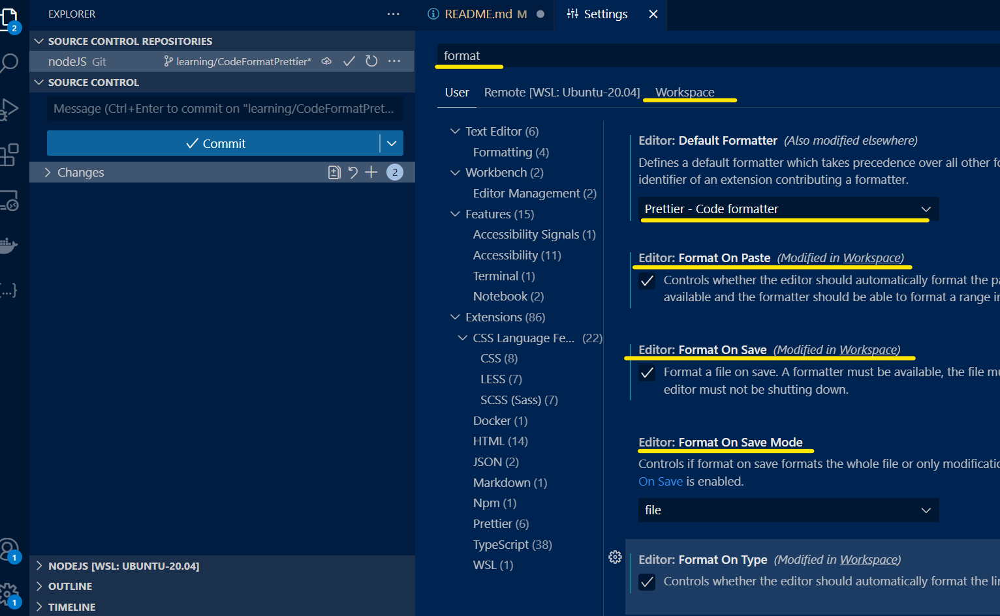

# nodeJS Prettier

What you need

:one: Prettier extension

:two: A folder named `.vscode` and a file named `settings.json`

:three: 


`settings.json` after the configuration

```json
{
  "editor.defaultFormatter": "esbenp.prettier-vscode",
  "editor.formatOnPaste": true,
  "editor.formatOnSave": true,
  "editor.formatOnType": true
}
```

Customize your format

add file name `.prettierrc`
```json
{
    "semi" : false,
    "singleQoute" : true,
    "tabWidth" : 4
}
```
